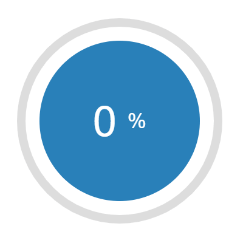

# Progress Circle

[![Version][version]][package] [![MIT License][license-badge]][license]

A simple lightweight circle progress web component with zero dependencies.
It's easy to use anywhere you want. For example in Angular, React, Vue, Ionic or vanilla HTML/JS etc.



## Features

- Indeterminate progress state. Shown as loading circle.
- Use of predefined colors (info, success, warning, danger), custom or inherited.
- Responsive size. Contains the parent size.
- No forced styles. Only limited by your creativity. See [demos][demos].

## Getting Started

Either via [NPM][package]:

```bash
npm i state-stepper
```

```ts
import `ui-progress-circle`;
```

or CDN:

```html
<script
  type="module"
  src="https://unpkg.com/ui-progress-circle@latest/dist/ui-progress-circle/ui-progress-circle.esm.js"
></script>
<script
  nomodule=""
  src="https://unpkg.com/ui-progress-circle@latest/dist/ui-progress-circle/ui-progress-circle.js"
></script>
```

## Usage

[See docs](./src/components/progress-circle/readme.md)

Some examples:

```html
<ui-progress-circle></ui-progress-circle>
<ui-progress-circle value="67"></ui-progress-circle>
<ui-progress-circle value="100" color="success"></ui-progress-circle>
<ui-progress-circle value="33" stroke="100"></ui-progress-circle>
<ui-progress-circle shape="round" color="info" radius="90"></ui-progress-circle>
```

See [demos][demos] page for style ideas.

### Angular

Angular must be configured to allow custom elements.

**app.module.ts**

```ts
import { NgModule, CUSTOM_ELEMENTS_SCHEMA } from '@angular/core';

@NgModule({
  /* ... */
  schemas: [CUSTOM_ELEMENTS_SCHEMA],
})
```

### Other

Search the web for "how to use web components in your framework".

**main.ts**

```ts
import { defineCustomElements } from 'ui-progress-circle/loader';
/* ... */
defineCustomElements();
```

## License

(C) Copyright 2020 Domink Geng [MIT][license]

<!-- Links -->

[license-badge]: https://img.shields.io/npm/l/ui-progress-circle.svg?style=flat-square
[license]: https://opensource.org/licenses/MIT
[version]: https://img.shields.io/npm/v/ui-progress-circle.svg?style=flat-square
[package]: https://www.npmjs.com/package/ui-progress-circle
[demos]: https://domske.github.io/ui-progress-circle-demo/
